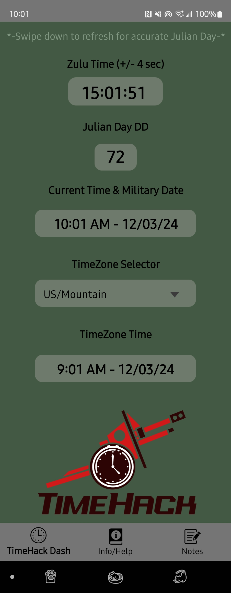
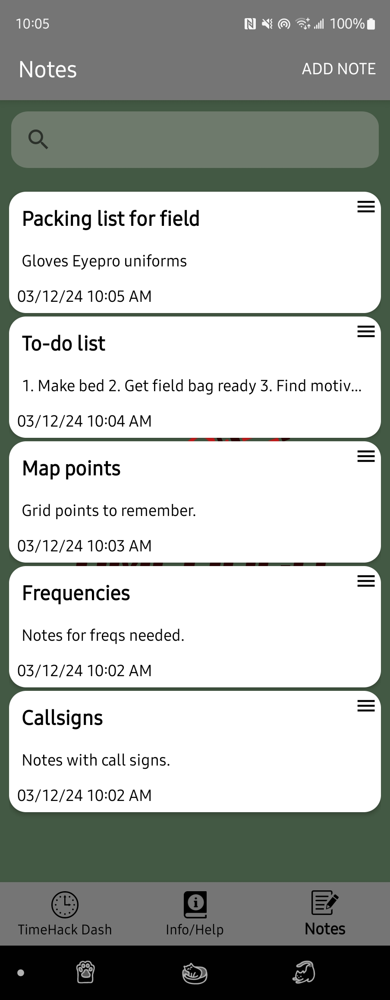

# TimeHack

---

 TimeHack is an application that can be used to help Soldiers of the United States military and also users of a Single Channel Ground & Airbourne Radio System. This project will consist of making it easier for operators by having all the information necessary for operating SINCGARS equipment in one place to increase efficiency with the equipment and also aid in teaching how to use the equipment. All of the information will be packed into one application that will be able to be used offline to increase Operational Security (OPSEC) and will utilize the operating personnel’s cellular/mobile device for time and date purposes. 

 
 The application consists of the following information in an easy to read and navigate format: 

  
•	Zulu date and time consisting of time in HH:MM:SS.

  
•	Julian day formatted in the DD format, 2-digit format for SINCGARS operation.

  
•	Time displayed for the location the operator is in and 1 display of time in a chosen time zone.

  
•	TM_11-5820-890-10-3 SINCGARS operator’s Manual (Approved for public release)

  
•	TM_11-5820-890-10-6 Pocket Guide SINCGARS ICOM Ground Radios (Approved for public release)

  
•	Quick sheet user guide to start up SINCGARS radio in single channel (SC) mode for operation.

  
•	Notes section – for general information for the operator to be easy to obtain during operation. Also makes for an easy 1 stop place for all Military notes in one application.

---

 Citations for Technical Manuals supplied in the application

 -TM_11-5820-890-10-3:

Headquarters, Dept. of the Army, Operator’s manual: Sincgars Ground Combat Net Radio, non-ICOM: Manpack Radio, AN/PRC-119 (NSN 5820-01-151-9915) (EIC: L2a), short range vehicular radio, AN/VRC-87 (NSN 5820-01-151-9916) (EIC: L2T) ... long range/long range vehicular radio, AN/VRC-92 (NSN 5820-01-151-9921) (EIC: L2y) (1997). Washington, D.C.

 -TM_11-5820-890-10-6:

Headquarters, Dept. of the Army, SINCGARS ICOM ground radios used with Automated Net Control Device (ANCD) AN/CYZ-10: Operator’s pocket knife: Radio sets, Manpack Radio (AN/PRC-119A) ... (NSN N/A) (EIC n/A) (1994). Washington, D.C. 

---
## Screenshots of Application in Use

<table>
  <tr>
     <td>Home Page</td>
     <td>Info Help Page</td>
     <td>Notes page</td>
  </tr>
  <tr>
    <td></td>
    <td></td>
    <td></td>
  </tr>
 </table>

---
###  Developed using Android Studio
##### TimeHack Application made by tksubie
##### Copyright 2024 Thaine Koen

